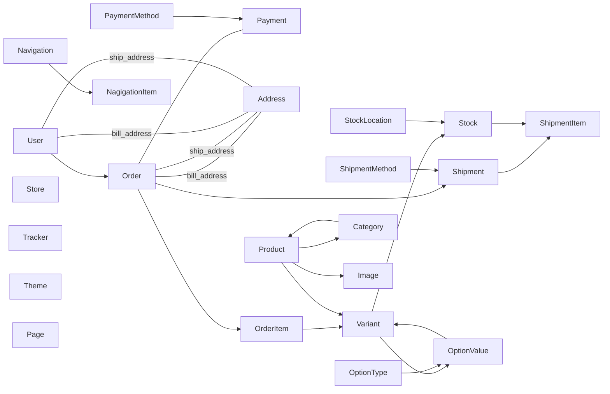

# モデル

`comable-core` に定義されている各種モデルを図にすると次のようになります（図中の線は1:1の関連を、矢印付きの線は1:多の関連を示します）。

```mermaid
graph LR;
    Order --> Shipment;
    Shipment --> ShipmentItem;
    Order --- Payment;
    Order -- bill_address --- Address;
    Order -- ship_address --- Address;
    Order --> OrderItem;
    OrderItem --> Variant;
    Product --> Variant;
    Variant --> Stock;
    Variant --> OptionValue;
    OptionValue --> Variant;
    OptionType --> OptionValue;
    Stock --> ShipmentItem;
    StockLocation --> Stock;
    Product --> Category;
    Category --> Product;
    Product --> Image;
    User -- bill_address --- Address;
    User -- ship_address --- Address;
    User --> Order;
    ShipmentMethod --> Shipment;
    PaymentMethod --> Payment;
    Navigation --> NagigationItem;
    Store;
    Tracker;
    Theme;
    Page;
```
