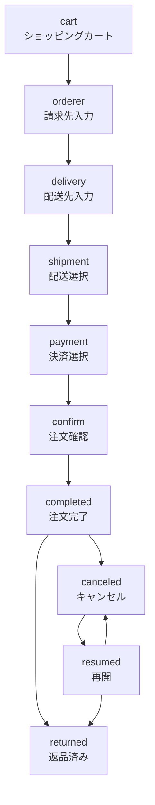

# ステートマシン

Comable では注文情報に [state_mashine](https://github.com/pluginaweek/state_machine) を利用することで、注文のフローや管理の実現を容易にしています。

注文のステートは次のように遷移します。

```mermaid
graph TD;
    cart --> orderer;
    orderer --> delivery;
    delivery --> shipment;
    shipment --> payment;
    payment --> confirm;
    confirm --> completed;
    completed --> canceled;
    completed --> returned;
    canceled --> resumed;
    resumed --> canceled;
    resumed --> returned;

    cart[cart<br/>ショッピングカート];
    orderer[orderer<br/>請求先入力];
    delivery[delivery<br/>配送先入力];
    shipment[shipment<br/>配送選択];
    payment[payment<br/>決済選択];
    confirm[confirm<br/>注文確認];
    completed[completed<br/>注文完了];
    resumed[resumed<br/>再開];
    canceled[canceled<br/>キャンセル];
    returned[returned<br/>返品済み];
```
