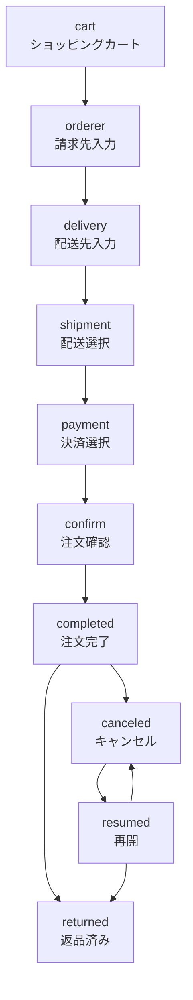
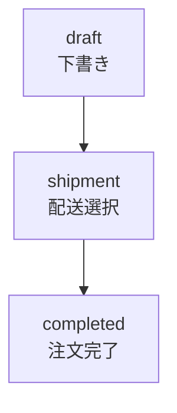
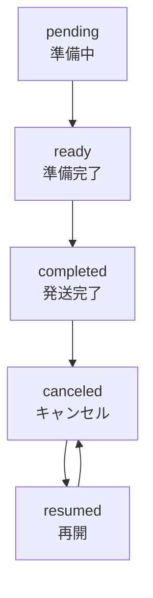
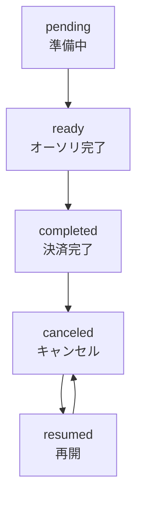

# ステートマシン

Comable では注文情報に [state_mashine](https://github.com/pluginaweek/state_machine) を利用することで、注文のフローや管理の実現を容易にしています。

## 注文

注文のステートは次のように遷移します。

## 下書き注文

注文のステートは次のように遷移します。注文完了後の遷移は通常の注文と同じです。

## 配送

配送のステートは次のように遷移します。

## 決済

決済のステートは次のように遷移します。

